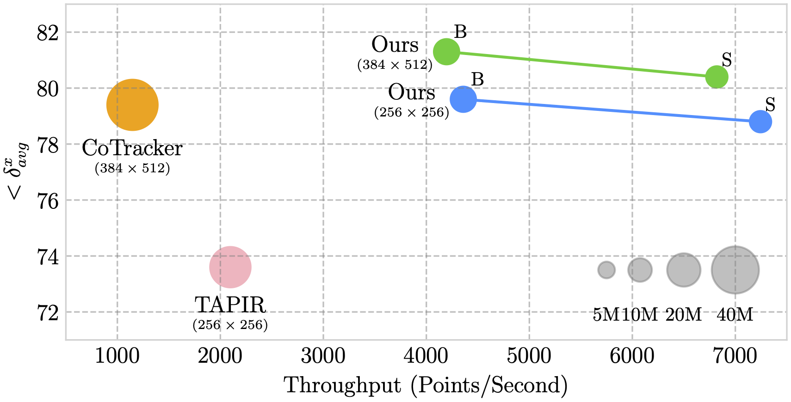

<div align="center">
<h1>Local All-Pair Correspondence for Point Tracking</h1>

[**Seokju Cho**](https://seokju-cho.github.io)<sup>1</sup> · [**Jiahui Huang**](https://gabriel-huang.github.io)<sup>2</sup> · [**Jisu Nam**](https://nam-jisu.github.io)<sup>1</sup> · [**Honggyu An**](https://hg010303.github.io)<sup>1</sup> · [**Seungryong Kim**](https://cvlab.korea.ac.kr)<sup>1</sup> · [**Joon-Young Lee**](https://joonyoung-cv.github.io)<sup>2</sup>

<sup>1</sup>Korea University&emsp;&emsp;&emsp;&emsp;<sup>2</sup>Adobe Research

**ECCV 2024**

<a href="https://arxiv.org/abs/2407.15420"></a>
<a href='https://ku-cvlab.github.io/locotrack'></a>
<a href='https://huggingface.co/spaces/hamacojr/LocoTrack'></a>

<p float='center'></p>
<span style="color: green; font-size: 1.3em; font-weight: bold;">LocoTrack is an incredibly efficient model,</span> enabling near-dense point tracking in real-time. It is <span style="color: red; font-size: 1.3em; font-weight: bold;">6x faster</span> than the previous state-of-the-art models.
</div>

## 📰 News
* **2024-07-22:** [LocoTrack](https://github.com/KU-CVLAB/locotrack/) is released.
* **2024-08-03:** PyTorch inference and training code released.
* **2024-08-05:** [Interactive demo](https://huggingface.co/spaces/hamacojr/LocoTrack) released.

**Please stay tuned for an easy-to-use API for LocoTrack, coming soon!**

## 🎮 Interactive Demo
Try our interactive demo on [Huggingface](https://huggingface.co/spaces/hamacojr/LocoTrack). To run the demo locally, please follow these steps:
1. **Install Dependencies**: Ensure you have all the necessary packages by running:
    ```bash
    pip install -r demo/requirements.txt
    ```

2. **Run the Demo**: Launch the interactive Gradio demo with:
    ```bash
    python demo/demo.py
    ```

## Training and Evaluation
For detailed instructions on training and evaluation, please refer to the README file for your chosen implementation:

- **[JAX Implementation](./locotrack/README.md)**
- **[PyTorch Implementation](./locotrack_pytorch/README.md)**

## Evaluation Dataset Preparation
First, download the evaluation datasets:
```bash
# TAP-Vid-DAVIS dataset
wget https://storage.googleapis.com/dm-tapnet/tapvid_davis.zip
unzip tapvid_davis.zip

# TAP-Vid-RGB-Stacking dataset
wget https://storage.googleapis.com/dm-tapnet/tapvid_rgb_stacking.zip
unzip tapvid_rgb_stacking.zip

# RoboTAP dataset
wget https://storage.googleapis.com/dm-tapnet/robotap/robotap.zip
unzip robotap.zip
```
For downloading TAP-Vid-Kinetics, please refer to official [TAP-Vid repository](https://github.com/google-deepmind/tapnet/tree/main/tapnet/tapvid).

## Training Dataset Preparation
Download the panning-MOVi-E dataset used for training (approximately 273GB) from Huggingface using the following script. Git LFS should be installed to download the dataset. To install Git LFS, please refer to this [link](https://docs.github.com/en/repositories/working-with-files/managing-large-files/installing-git-large-file-storage?platform=linux). Additionally, downloading instructions for the Huggingface dataset are available at this [link](https://huggingface.co/docs/hub/en/datasets-downloading)
```bash
git clone git@hf.co:datasets/hamacojr/LocoTrack-panning-MOVi-E
```


## 📚 Citing this Work
Please use the following bibtex to cite our work:
```
@article{cho2024local,
  title={Local All-Pair Correspondence for Point Tracking},
  author={Cho, Seokju and Huang, Jiahui and Nam, Jisu and An, Honggyu and Kim, Seungryong and Lee, Joon-Young},
  journal={arXiv preprint arXiv:2407.15420},
  year={2024}
}
```

## 🙏 Acknowledgement
This project is largely based on the [TAP repository](https://github.com/google-deepmind/tapnet). Thanks to the authors for their invaluable work and contributions.
